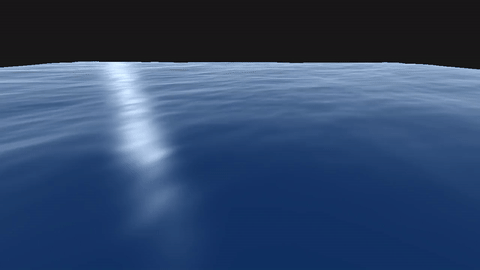

# Ocean Simulation

A real-time ocean wave simulation using phillips spectrum and Fast Fourier Transform (FFT) for ocean rendering.
Download the hand_landmarker.task file [here](https://developers.google.com/mediapipe/solutions/vision/hand_landmarker#models).
Using iwave algorithm to simulate wake propagation

## Resources & References

### Primary Resources
- **[Garrett Gunnell's Water Simulation](https://github.com/GarrettGunnell/Water)** 
- **[Keith Lantz - Ocean Simulation FFT](https://www.keithlantz.net/2011/11/ocean-simulation-part-two-using-the-fast-fourier-transform/)** 
- **[Biebras Ocean Simulation Unity](https://github.com/Biebras/Ocean-Simulation-Unity)** 
- **[Ocean Surface Simulation Course Notes](https://jtessen.people.clemson.edu/reports/papers_files/coursenotes2004.pdf)** 
- **[IWave Algorithm](https://jtessen.people.clemson.edu/reports/papers_files/Interactive_Water_Surfaces.pdf)** 

## Cubemap Customization

You can modify the visual style of the simulation by editing the following parameters:

| Parameter | File | Variable | Effect |
| :--- | :--- | :--- | :--- |
| **Sky Top** | `src/renderer.py` | `color_top` | The color of the upper sky/zenith. |
| **Sky Bottom** | `src/renderer.py` | `color_bottom` | The color of the horizon. |
| **Water Base** | `shaders/fragment.glsl` | `base_color` | The primary color of the deep water. |
| **Specular Glint** | `shaders/fragment.glsl` | `vec3(...)` | The color of the bright highlights on wave peaks. |

*Note: Colors are defined as RGB values normalized between `0.0` and `1.0`.*

## TODO
- [X] Atlas from temu lighting
- [X] Add foam
- [ ] Actual buoyancy